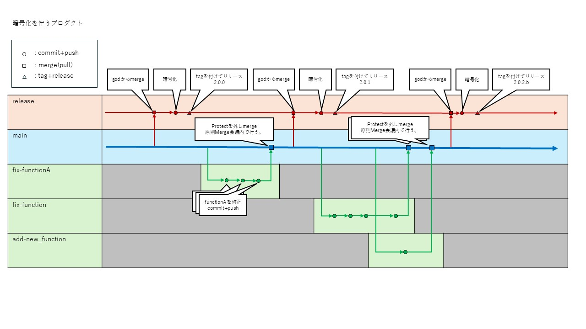

# product_management_repository
プロダクト管理の勉強用リポジトリ

# ルール
## ブランチのルール
- release: 難読化対応したリリース用
- main: メインのブランチ。ソースコードの神様となる。
- xxxx/yyyy:　メンテナンス用のブランチ。（mainをソースにして、ブランチを切る）
  - xxxx: fix, feature, doc-update or chore
      - fix: バグの修正
      - feature: 新規機能の追加
      - doc-update: ドキュメントの更新
      - chore: 雑多用。CI/CDの更新や、内部用READMEの更新など。
  - yyyy: 作業内容の概要を記載
    
    (例)  
    fix/object-detection-library  
    feature/function-a  
    doc-update/fix-typo  
    chore/cicd-update

## リリース/タグルール
リリースできるのは、`release`ブランチのみ。  
`main`からpullし、ソースコードに対して暗号化を実施。その後、タグをつけ、リリースを行う。  
リリース後は「Action」を確認し、エラーが出ていないか確認を行う。（GithubActionにより、リリースを行った際にreleaseブランチかどうか判定を行っている。）  
他のブランチをリリースしようとすると、エラーは発出されるので、速やかにリリースとタグの削除を行う。

タグの命名規則  
（例）1.0.0.xxxx

aa.bb.cc.dd  
aa: メジャーアップデート（年度跨ぎ or 新規機能が追加された場合。）  
bb: 仕様変更  （各機能のI/F変更など。）  
cc: バグ修正  （リリース先でバグが見つかった場合など。）  
dd: optional, リリース先ごと特殊な対応をした場合など。 （グループ企業以外のリリース時のミニマム化？サンプルの提供なども？）   

なお、マニュアルについても、ソースコードのバージョンと対応させることとし、変更がなくともともにバージョンアップしていくこととする。

## 運用フロー概要図

# リリースノート

|    | バージョン          |     概要            |    リリース日     |            備考                       |
|----|--------------------|---------------------|------------------|--------------------------------------|
|    |    1.0.0           |   初回リリース       |    2025/2/1      |                                      |
|    |    1.0.1           |   バグ修正           |    2025/4/1      |                                      |
| ✔ |    1.0.2.b         |   ～機能PoC対応       |    2025/5/1      |           b社、個別対応               |

# リリース状況
|             |     A社     |     B社     |     C社     |     D社     |     E社     |     TBD     |
|-------------|-------------|-------------|------------|-------------|-------------|-------------|
|   1.0.0     |     ✔      |      ✔      |     ✔      |     ✔      |      ✔      |             | 
|   1.0.1     |            |              |            |     ✔      |             |             | 
|   1.0.2.b   |            |      ✔      |             |            |             |             | 

